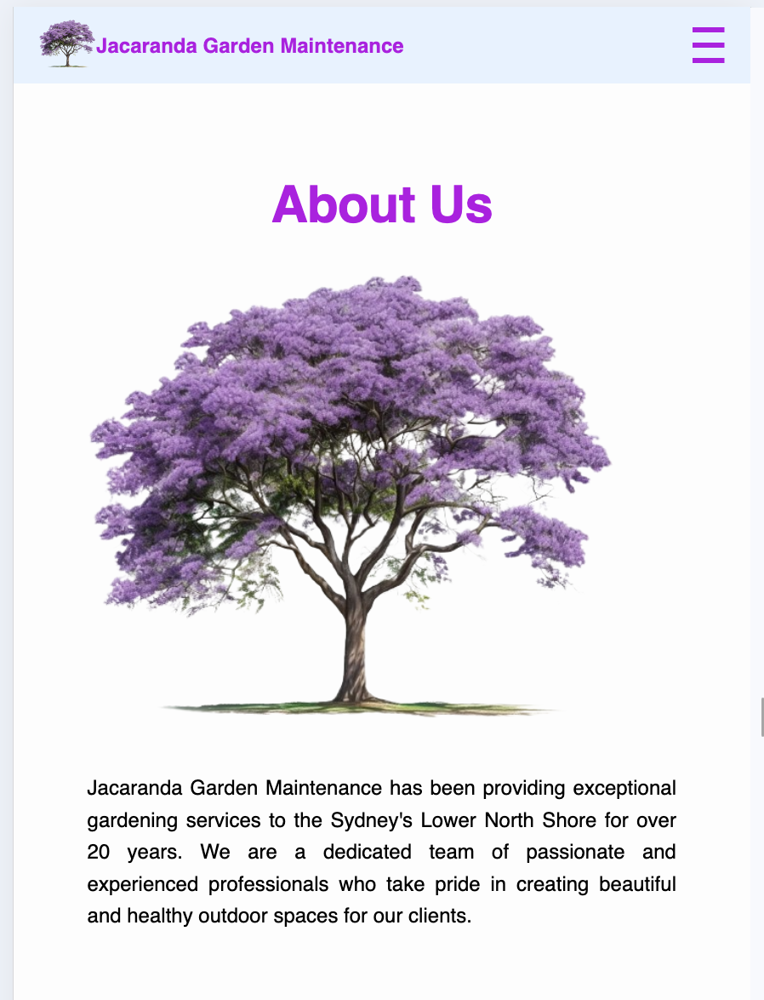

# Jacaranda Garden Maintenance

Jacaranda Garden Maintenance provides exceptional gardening services in Sydney's Lower North Shore. We offer a wide range of services including gardening, mowing, hedging, strata cleaning, and more. Contact us for a free quote!

Here is the link to the webisite: https://meworld.site/

## Table of Contents
- Project Overview
- Features
- Technologies Used
- How to Use
- Contact

## Project Overview
This project is a simple, responsive website for Jacaranda Garden Maintenance. It includes sections about the company, the services offered, service areas, reasons to choose the company, and a contact form for getting a quote.

## Features
- **Responsive Design**: The website adapts to different screen sizes using media queries.
- **Navigation Bar**: A navigation bar that includes a logo, company name, and links to various sections of the website.
- **About Us Section**: Information about the company and an image.
- **Services Section**: List of services provided by the company.
- **Service Area Section**: List of areas serviced by the company.
- **Why Choose Us Section**: Reasons to choose Jacaranda Garden Maintenance.
- **Quote Form**: A form to get a quote with fields for personal details, property address, and services required.
- **Footer**: Contact information and site map.

## Technologies Used
- **HTML**: Structure of the website.
- **CSS**: Styling of the website.
- **JavaScript**: Basic interactivity such as hamburger menu for mobile navigation.

## How to Use
- **Navigation**: Use the navigation bar to jump to different sections of the website.
- **About Us**: Learn more about the company and its history.
- **Our Service**: Explore the various services offered by Jacaranda Garden Maintenance.
- **Service Area**: Check if your area is covered by the company's services.
- **Why Choose Us**: Understand the reasons to choose Jacaranda Garden Maintenance.
- **Get a Quote**: Fill out the form to request a quote for services.

## Contact
**Jacaranda Garden Maintenance**

P.O Box: 328, Cammeray NSW 2062
Email: jacarandagardens@garden.com
Phone: 0404889711

## Code Structure
### HTML
The HTML file defines the structure of the webpage, including meta tags, header, main content, and footer.

### CSS
Two CSS files are included:
- style.css: Main stylesheet for general styling.
- responsive.css: Second stylesheet for responsive screen.

### JavaScript
It is used to implement toggling the hamburger menu for mobile navigation.

## Deployement
### 1. Log In and Navigate to Project
- Login to your Netlify account.
- Navigate to the desired website project.

### 2. Access Domain Management
- In the project settings, locate the "Domain Management" section.

### 3. Add Custom Domain
- Click "Add a domain" and enter your custom domain name (e.g., yourcompany.com).
- Click "Verify" to confirm ownership of the domain.

### 4. Update DNS Records (Pointing Domain to Netlify)
- Netlify will provide you with a set of DNS records (usually 4 nameservers).
- Log in to your domain registrar's account where you purchased the domain.
- Locate the DNS management section for your custom domain.
- Update the existing nameservers with the ones provided by Netlify.
- Save the changes.

### 5. Waiting Time
- The DNS update might take some time (usually within 24 hours) to propagate globally. During this time, your website might not be accessible through the custom domain.

## Screenshot
